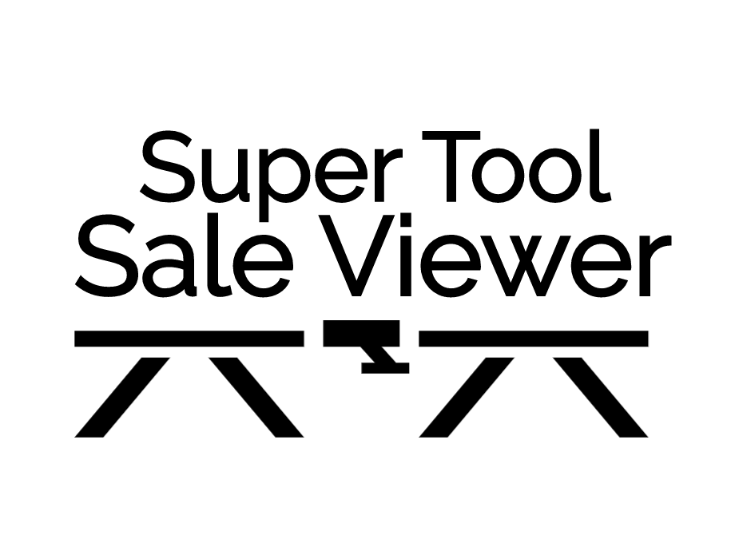
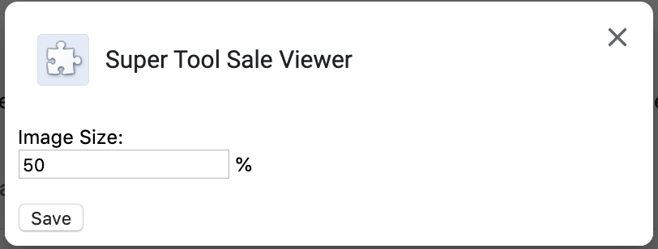

# Supertooled
[Privacy Policy](PRIVACY.md) | [Corbett Made](https://corbettmade.com) | [SuperTool (not affiliated)](http://supertool.com)

A Chrome extension that converts the Image links in supertool.com for sale lists to in-line images for ease of browsing.

# Permissions
Only requires `Storage` permissions to save settings, and permission to change what you see on `supertool.com`.

It will ask for this on install.

# Safety
All of the code this extension runs is public in this repository. Its sole function is to replace the image links in the monthly supertool sales pages with a visible image.

# Installation

* Download the latest release from https://github.com/asciifaceman/supertooled/releases
* Unzip, it will create a CRX file
* Navigate to `chrome://extensions`
* Enable Developer mode in the top right
* Drag and drop the CRX file into the extensions page
* You're done!

# Usage
Just navigate to a supertool monthly sale page and it will do the work!

### Settings
You can configure the % of image size

* Navigate to chrome://extensions in your Chrome browser
* Select `Details` for Super Tool Sale Viewer
* Select `Extension options`
* Set a % (25, 50, 100, etc) and Save
* Reload the supertool list page

# Author
Charles Corbett <chas@corbettmade.com>